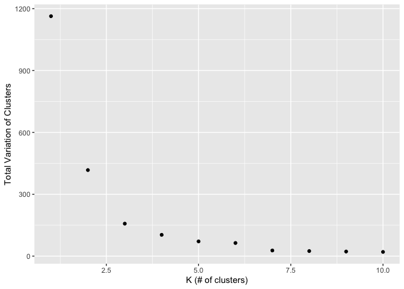
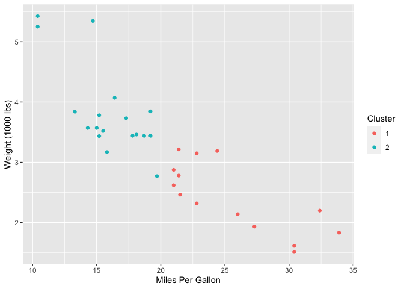

The Most Interesting Machine Learning Method
================

Recently, I’ve been learning about different machine learning methods in
one of my statistics courses at NCSU. I thought I would share some of my
thoughts on my favorite one!

**What method did you find most interesting?**

Based on some of my previous blog posts, it may be clear that I am quite
the visual learner. Along those lines, I find clustering methods very
interesting as the outputs from these methods are very visually
appealing. One popular clustering method is *K Means Clustering.*

A *K Means Clustering* algorithm wants to assign all data points into
different clusters, choosing the cluster for each point by trying to
minimize the Euclidean distances of all points to their assigned cluster
centers.

A clear difficulty with this kind of model is figuring out how many
clusters you should use to classify your data. The general rule of thumb
is to calculate the total variation within your different clusters over
a range of cluster numbers, and look for an “elbow” in the plot.

Let’s look at the `mtcars` dataset and use just the miles per gallon
(`mpg`) and weight (`wt`) variables for simplicity. First, let’s see how
many clusters we should use.

``` r
#Create initial vectors
k <- c(1:10)
tot.withinss <- c(1:10)

#Get error values for the different cluster numbers
for (i in 1:10) {
  clusters <- kmeans(mtcars, i, iter.max = 10)
  tot.withinss[i] <- clusters$tot.withinss
}

#Create plot!
ggplot() + geom_point(aes(x=k, y=tot.withinss)) + xlab("K (# of clusters)") +
     ylab("Total Variation of Clusters")
```

<!-- -->

The “elbow” looks to be at either 2 or 3 clusters. Let’s go with 2 and
create our **K Means Clusters**!

``` r
library(ggplot2)
#Set seed for reproducibility
set.seed(123)

#Select variables
mtcars <- mtcars %>% select(mpg,wt)

#Get cluster classifications for two clusters
clusters <- kmeans(mtcars, 2, iter.max = 10)

#Add classifications to data set for plot aesthetic
mtcars$cluster <- clusters$cluster

#Plot results!
ggplot(mtcars,aes(col = as.factor(cluster))) + geom_point(aes(x=mpg, y=wt)) + 
  xlab("Miles Per Gallon") + ylab("Weight (1000 lbs)") + 
  labs(col = "Cluster")
```

<!-- -->
